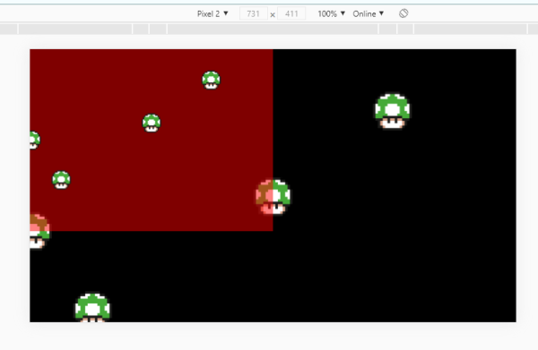
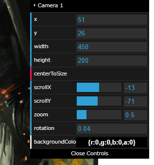

# 機能の探し方

Phaserゲームフレームワークでゲーム制作をする場合、  
フレームワークの機能を調べるにはいくつか方法があると思います。

1.  [公式のAPI Documents](https://photonstorm.github.io/phaser3-docs/)から機能を調べる
2. [公式のExamples](http://labs.phaser.io/index.html)から機能を調べる
3. web上のチュートリアルを探す
4. githubで公開されているサンプルを見る

機能について、実際の画面上の挙動を確認するには2.の方法が良いと思います。  
しかし、PhaserのExamplesは現在、1772もあります！  

実際にExamplesに飛ぶと、ある程度の分類はされているようですが、いまいち探し方が分からない…  
ここでは、Examplesの分類ごとにどんな物があるかを調べた結果を記載しています。

<Info>
Phaser公式サイト内のExamplesとラボ(http://labs.phaser.io/)のExamplesは基本的に同じ内容のようです。

すぐにメンテナンスされそうなのはラボの方だと思うので、基本的にそちらの内容で解説していきます。
</Info>

<LinkCard title="ローカルでExampleを見る方法はこちら" url="/nyumon/devenv/buildlocalexamples" />

# サイトの使い方:hammer_and_pick:

- サムネイルが似ているものは、近い機能の説明となっている
例えばランスロット

# LiveCording用インターフェイス

Exampleの個別のページ下部にはLiveCording等が行えるインターフェイスが付いています。  
（一部のExampleには無いものもあります）


- Back : 前の画面に戻る
- Edit : LiveCording画面の表示
- Open Issue : [Phaser公式のExamplesのIssue](https://github.com/photonstorm/phaser3-examples/pulls)を表示します
- iFrame : iFrameでゲームエリアを表示
  - div : divでゲームエリアを表示
- 100% : 画面いっぱいに表示
- Dev Build : Phaser本体の実行バージョンを変えます
  - 新しい機能の場合、古いバージョンは動かないことが多いです
- Labs : ？
- Mobile : モバイル用表示
  - Chromeの開発者用ツールでモバイル画面サイズで確認すると良さそうです



Chrome開発者用ツールの簡単な使い方
- Chrome起動中にF12キーを押す
- デバッグ画面が開くので左上のスマフォボタンを押す
- スマフォ表示に切り替わる。
  - 必要に応じて、機種の選択・画面回転などを行う

# GUI付きExample

Exampleの中には、ゲーム画面に下記のようなGUI付きのものがあります。  
Exampleで注目すべき項目のパラメーターを、リアルタイムで変更できます。



# コードの読み解き方のヒント

ソースコードが長いExampleは、注目すべき実装がどこにあるか分からなくなります。  
コードを読む時のいくつかのヒントを記載します。

## クリックイベントに着目する
クリックして変化するExamplは、  
以下のような`pointerdown`イベントから読み解いていくとコードが追いやすい。

```js
this.input.on('pointerdown', function (pointer) {
    const child = this.children.getAt(0);
    child.y -= 32;
    this.children.bringToTop(child);
}, this);
```

Phaserでは、`XXX.on`または`XXXX.once`で大体のイベントを設定している。

## 演出用のTweenを止めてみる

Examplesではアニメーションの見栄えが非常に良くなるTweenが多用されている。  

```
this.tweens.add({
  ///tween設定
})
```

Examplesのコード量が多く大事な処理がわからない場合は、
試しにtween部分をコメントアウトして動かしてみる。

## Groupのrepeat数を1にしてみる

大量のGameObjectを動かしている例は、  
まずはGroup内のGameObject数を１つにしてみると基本的な動きが追いやすい。

