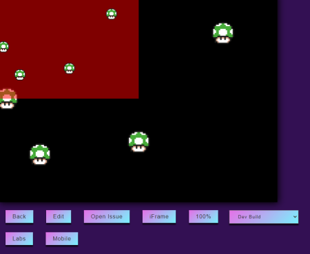

# 機能の探し方

Phaser でゲーム制作をする場合、  
フレームワークの機能を調べるにはいくつか方法があると思います。

1.  [公式の API Documents](https://photonstorm.github.io/phaser3-docs/)から機能を調べる
2.  [公式の Examples](http://labs.phaser.io/index.html)から機能を調べる
3.  web 上のチュートリアルを探す
4.  github で公開されているサンプルを見る

機能について、実際の画面上の挙動を確認するには 2.の方法が良いと思います。  
しかし、Phaser の Examples は現在、1772 もあります！

実際に Examples に飛ぶと、ある程度の分類はされているようですが、いまいち探し方が分からない…  
ここでは、Examples の分類ごとにどんな物があるかを調べた結果を記載しています。

<Info>
Phaser公式サイト内のExamplesとラボ(http://labs.phaser.io/)のExamplesは基本的に同じ内容のようです。

すぐにメンテナンスされそうなのはラボの方だと思うので、基本的にそちらの内容で解説していきます。
</Info>

<LinkCard title="ローカルでExampleを見る方法はこちら" url="/nyumon/devenv/buildlocalexamples" />

# サイトの使い方

Example ラボのサイトを開くと、フォルダが並んでいます。
機能別で内容が分けられています。  
フォルダ内には個別の Example があり、開くと実行できます。

<LinkCard title="機能の大まかな解説はこちら" url="/nyumon/officialexplorer/examplesclassify" />

## LiveCording 用インターフェイス

Example の個別のページ下部には LiveCording 等が行えるインターフェイスが付いています。  
（一部の Example には無いものもあります）



- Back : 前の画面に戻る
- Edit : LiveCording 画面の表示
- Open Issue : [Phaser 公式の Examples の Issue](https://github.com/photonstorm/phaser3-examples/pulls)を表示します
- iFrame : iFrame でゲームエリアを表示
  - div : div でゲームエリアを表示
- 100% : 画面いっぱいに表示
- Dev Build : Phaser 本体の実行バージョンを変えます
  - 新しい機能の場合、古いバージョンは動かないことが多いです
- Labs : ？
- Mobile : モバイル用表示
  - Chrome の開発者用ツールでモバイル画面サイズで確認すると良さそうです


Chrome 開発者用ツールの簡単な使い方

- Chrome 起動中に F12 キーを押す
- デバッグ画面が開くので左上のスマフォボタンを押す
- スマフォ表示に切り替わる。
  - 必要に応じて、機種の選択・画面回転などを行う

## GUI 付き Example

Example の中には、ゲーム画面に下記のような GUI 付きのものがあります。  
Example で注目すべき項目のパラメーターを、リアルタイムで変更できます。


# コードの読み解き方のヒント

ソースコードが長い Example は、注目すべき実装がどこにあるか分からなくなります。  
コードを読む時のいくつかのヒントを記載します。

## 共通サムネイルをチェック

サムネイルが似ている Example は、近い機能の説明となっています。  
ソースコードがほとんど共通のため、チェックがしやすいはずです。

例えば、Animation Examples では、鎧の騎士(ランスロット 🤖)のサムネイルが複数あります。


この Examples は Event に関わるもので似たような内容になっていました。

## クリックイベントに着目する

クリックして変化する Exampl は、  
以下のような`pointerdown`イベントから読み解いていくとコードが追いやすい。

```js
this.input.on(
  "pointerdown",
  function (pointer) {
    const child = this.children.getAt(0);
    child.y -= 32;
    this.children.bringToTop(child);
  },
  this
);
```

Phaser では、`XXX.on`または`XXXX.once`で大体のイベントを設定している。

## 演出用の Tween を止めてみる

Examples ではアニメーションの見栄えが非常に良くなる Tween が多用されている。

```
this.tweens.add({
  ///tween設定
})
```

Examples のコード量が多く大事な処理がわからない場合は、
試しに tween 部分をコメントアウトして動かしてみる。

## Group の repeat 数を 1 にしてみる

大量の GameObject を動かしている例は、  
まずは Group 内の GameObject 数を１つにしてみると基本的な動きが追いやすい。
