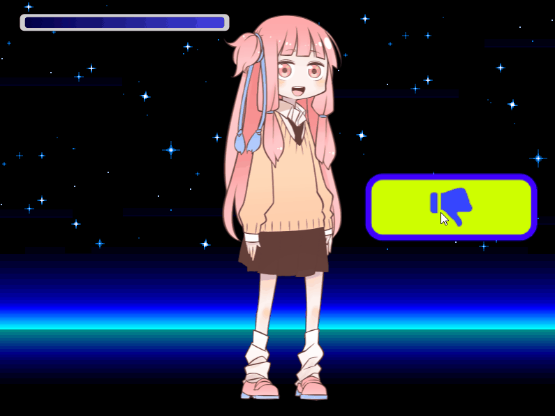

ここでは、ライフゲージの実装について記載します。

# 参考サイト

プロの方が体力ゲージ UI についての解説をしています。  
デザイン毎にどのように情報をユーザーに提供しているのか等の詳しい内容になっています。

https://limesode.hatenablog.com/entry/2019/12/09/002228

この記事によるとテクスチャの UV スクロールでの実装が一番処理コストが安いとのことです。  
Phaser での実装はどうやるのか？🤔:hammer_and_pick:

# 矩形で作る

簡単には、[GameObject の矩形クラス](https://photonstorm.github.io/phaser3-docs/Phaser.GameObjects.Rectangle.html)を利用します。  
キャラクター残りライフに合わせて、矩形のサイズを変更すれば実装完了です。  
この方法では、Graphics クラスよりも負荷が低いです。

下記のサイトでは、ダウンロード用のプログレスバーの実装例を紹介しています。

https://gamedevacademy.org/creating-a-preloading-screen-in-phaser-3/?a=13

デメリットとしては、見た目がそんなに良くないことですね…😥

# Graphics で作る

Graphics クラスを利用すると、  
角丸付きの形状や、四隅のグラデーションなど高度な形状が利用できます。

参考）Graphics クラス角丸の作り方  
http://labs.phaser.io/view.html?src=src\game%20objects\graphics\fill%20rounded%20rectangle.js

Graphics は Update 内で毎回クリアして、形状を変化させ、再度描画するという工程が必用です。  
Graphics を使った描画内容が増えると、処理コストが増えていきます。  
可能ならば、下記の画像を利用した実装でやるほうが良いでしょう。

# 画像で作る

画像を利用すれば、リッチな表現が可能です。  
メモリを消費しますが、処理負荷は低く済みます。

実装方法は以下の解説サイトが参考になります。

https://www.emanueleferonato.com/2019/04/24/add-a-nice-time-bar-energy-bar-mana-bar-whatever-bar-to-your-html5-games-using-phaser-3-masks/

考え方

- ライフゲージ画像と同じ形状のマスクを重ねる
  - マスクと同じ形なので最初はすべて表示されている
- マスクの位置を左にずらすと、ライフゲージ右側がマスク外になり、非表示になる。

## この方法で実装した例

このページトップ画像の様な感じになりました。  
参考ソースは以下のリポジトリに配置しています。

https://github.com/umi-tyaahan/lifegauge
