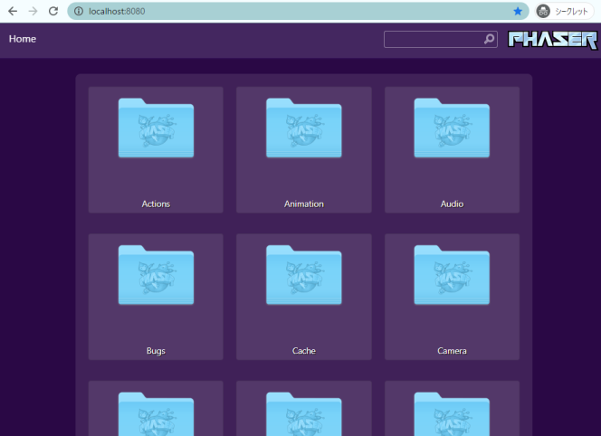

ここでは、ローカル環境でExamplesサイトが見えるようにする方法を説明します。

[Phaser公式のラボExamples](http://labs.phaser.io/)は、ライブコーディングに対応しており、  
ちょっと機能を試すのに大変便利です。  

ただ、世界中の方が見るせいか割とよく落ちます😭  
開発中に突然見れなくなると腹が立ちます！  

実はGithubにExamplesサイトの全コードが上がっています。  
ローカルでいつでも見れるようにしておくとゲーム開発に大変便利です。  

Examplesリポジトリはこちら。  
https://github.com/photonstorm/phaser3-examples  

# 環境:hammer_and_pick:
Phaser開発環境が整っていることが前提です。  
ここではざっくりとした環境を記載しています。

- windows10 / wsl2 / ubuntu v20.0.1
- windowsTerminal
  - windowsでのwsl2環境の構築方法は[こちらの記事](https://zenn.dev/moroya/articles/0ab24a733e4b7a)を参考にしました
- git
- yarn

# コマンド
```js
git clone git@github.com:photonstorm/phaser3-examples.git
yarn install # build関連ファイルをdownloadします
yarn start # サーバーが起動します / http://localhost:8080でアクセスできます
```

うまくいきました🎉  
これなら素早く見れるし、腹も立ちません🤗

# その他

- GitHubからのダウンロードには1GB近い？容量があります  
  - `git clone`の完了までかなりの時間がかかります
- puppeteerのエラー対応
  - windows(wsl2)環境でなにかpuppeteer関連をやろうとすると、まぁーだいだい動きません🎃
  - [ここらへんの記事](https://stackoverflow.com/questions/52993002/headless-chrome-node-api-and-puppeteer-installation)が参考になるかもしれません

